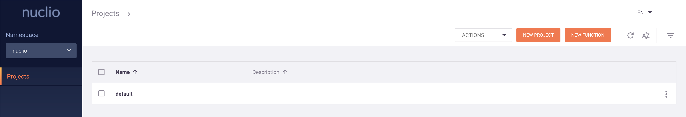
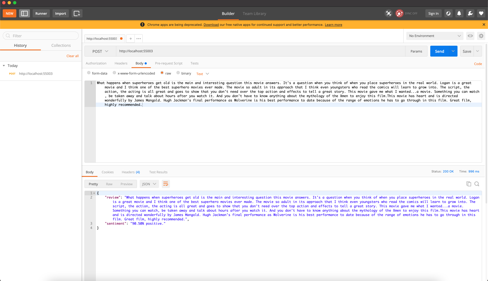

# Serverless AI

This repository focus on applying engineering techniques to deploy serverless Deep Learning models.

# Nuclio

## Running the Nuclio Dashboard

The Nuclio Dashboard is nothing more than a microservice exposing a GUI (a.k.a. Graphical User Interface)
where the user can see the running functions, change settings, create projects, etc.

Of course, all the above mentioned can be done using the Nuclio CLI. But before we get there, please make
sure the command below is executed:

```shell script
docker run -p 8070:8070 -v /var/run/docker.sock:/var/run/docker.sock \
-v /tmp:/tmp -d --name nuclio-dashboard quay.io/nuclio/dashboard:stable-amd64
```

If you go to [http://localhost:8070](http://localhost:8070), you should be able to see something like the image below:



## Nuclio CLI

All you need to know about installing the Nuclio CLI can be found here:

* [Nuclio CLI Reference Guide](https://github.com/nuclio/nuclio/blob/development/docs/reference/nuctl/nuctl.md)

Once you have installed it, please give it a try with this:

```shell script
nuclt --help
```

Your output should look like this:

```shell script
Nuclio command-line interface

Usage:
  nuctl [command]

Available Commands:
  build       Build a function
  create      Create resources
  delete      Delete resources
  deploy      Build and deploy a function, or deploy from an existing image
  export      Export functions or projects
  get         Display resource information
  help        Help about any command
  import      Import functions or projects
  invoke      Invoke a function
  update      Update resources
  version     Display the version number of the nuctl CLI

Flags:
  -h, --help                help for nuctl
  -k, --kubeconfig string   Path to a Kubernetes configuration file (admin.conf)
  -n, --namespace string    Namespace
      --platform string     Platform identifier - "kube", "local", or "auto" (default "auto")
  -v, --verbose             Verbose output

Use "nuctl [command] --help" for more information about a command.
```

# Creating projects and deploying functions

## Your first sample project

```shell script
nuctl create project nuclio-sample --platform local
```

The command above is doing the following:

1. Creating a project called `nuclio-sample`;
2. Telling Nuclio this should be created in a local (your MacBook) platform.

If you now go to your [http://localhost:8070](http://localhost:8070), you will be able to see the project we just created. 

## Building the Docker image

Well, we are building Docker based Nuclio functions. It's not a hard requirement, as you can just have your sample code
deployed directly. However, I appreciate the isolation created by Docker containers.

From the root of the repository, please run the command below:

```shell script
docker build -f samples/nuclio-sample/docker/nuclio-function.dockerfile -t nuclio-function samples/nuclio-sample/.
```

## Deploying the sample function

So, the Docker image has been created. Now what? Now it's time to deploy our sample function. Yeah, we are doing this!

```shell script
nuctl deploy nuclio-function \
--project-name nuclio-sample \
--run-image nuclio-function \
--runtime python \
--handler application:greet \
--platform local
```

The command above is doing a lot of things. It's safe to assume that given the parameters' names, you should know what
it's doing. However, some explanation never hurts:

1. It deploys the `nuclio-function`;
2. Onto the project `nunclio-sample`;
3. Based on the Docker image we built, called `nunclio-function`;
4. With a Python runtime;
5. Expecting a function handler under `application:greet` - please check the source code;
6. And again, it's a local deployment.

You should be able to see your function running here: [http://localhost:8070/projects/nuclio-sample/functions](http://localhost:8070/projects/nuclio-sample/functions)

Please, copy the `Invocation URL` for further usage. You can find it either on the dashboard or via the Nuclio CLI with
the command below:

```shell script
nuctl get functions nuclio-function --platform local
```

* Output example:

```shell script
  NAMESPACE |      NAME       |    PROJECT    | STATE | NODE PORT | REPLICAS  
  nuclio    | nuclio-function | nuclio-sample | ready |     55002 | 1/1  
```

The `node port` means through which port you can access your service. 

## Invoking the sample function

Want to give it a try? You can have a look at one of the following ways to do so:

### Using the Nuclio CLI

```shell script
nuctl invoke nuclio-function -m POST --platform local
```

* Expected response:

```shell script
> Response headers:
Server = nuclio
Date = Wed, 07 Apr 2021 13:30:41 GMT
Content-Type = text/plain
Content-Length = 21

> Response body:
Hello, from Nuclio :]
```

### Using cURL

```shell script
 curl -G http://localhost:[NODE_PORT]
```

# Deploying a Deep Learning powered service

Deploying sample and basic examples is something fun to do, but it doesn't show the real added value of using something
like serverless services. In order to do so, let's look at a more mature service, that could actually be useful for
something: Sentiment Analysis of Film Reviews.

Thankfully we already have some code for that, not to mention a pre-trained Deep Learning model.

*Remark*: although the model is not included in the git repository - not a good practice. You can download it from
here: [model](https://drive.google.com/drive/folders/1-KATumzLO0Z9YtEzDY6WQ2_UZM7Ef1Ct?usp=sharing)

The `hdf5` model file should go under `sentiment-sample/application/model`.

After the part is done, you know the drill. 

## Creating the serverless-ai project

```shell script
nuctl create project serverless-ai --platform local
```

## Building the Docker image

```shell script
docker build -f samples/sentiment-sample/docker/sentiment.dockerfile \
-t sentiment-analysis samples/sentiment-sample/.
```

# Deploying the Deep Learning function

```shell script
nuctl deploy sentiment-analysis \
--project-name serverless-ai \
--image sentiment-analysis \
--path samples/sentiment-sample/application \
--file samples/sentiment-sample/resources/config.yaml \
--platform local
```

*Wait, wait, wait!*

What's happening in the command above? Things have changed! Okay, calm down.

So, most of the parameters are related to what we have seen before. However, we do have some changes there. Let's list them:

1. `--image` instead of `--run-image`
- It means we will make use of an image entry and deploy our function there, not running an image with the code already inside it.
  - Please, have a look at both Docker files. 
2. `--path` but no `--handler`
- We give the location of our project, py file and model, and the handler configuration will be in the YAML file.
3. `--file` but no `--runtime`
- We inform the path to the YAML file, which already has the runtime configuration, instead of informing the runtime.

## Invoking function
using PostMan

So, the function handler will expect any parameter to be in the body of the request. A good and simple way to try
this service out is by invoking the function using PostMan. Have a look at the screenshot below:



# Acknowledgements

Thanks to you all for spending some time reading through - if you made that far - and for trying it out - I hope you did.

Nuclio is very powerful, works well and has a strong community behind it.

As a remark: I do not work for them and I'm not here to advertise anything: I simply tried and loved it. :)

Have fun and see you around.